# Bildschirmfotos aus dem Client-Test

Stand: ca160d891ca6ac066d89df14e3077a08a4c987b5 (Branch main)

## 0000_goblinforest-01-draufsicht

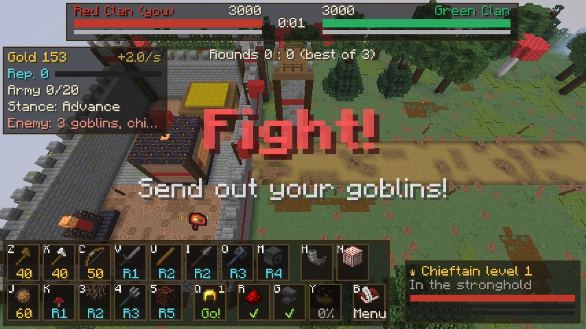

## 0001_goblinforest-02-feuerball-zielen

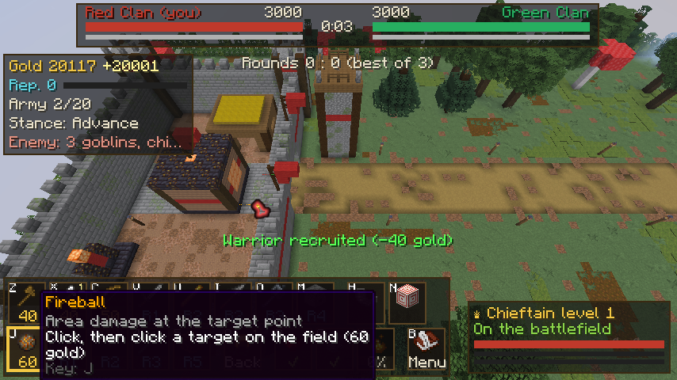

## 0002_goblinforest-03-armee

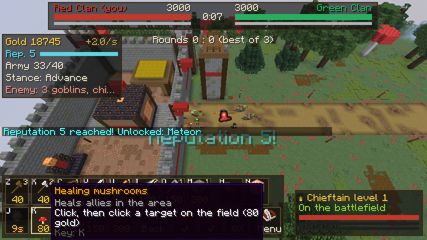

## 0003_goblinforest-04-nah

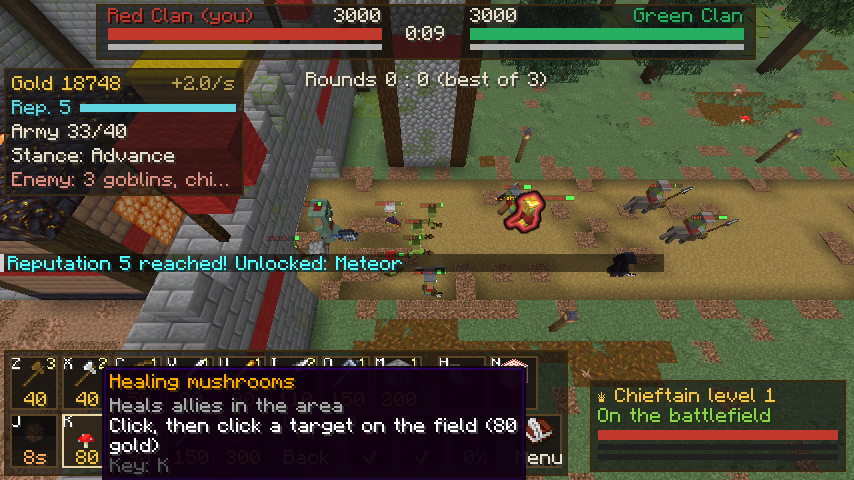

## 0004_goblinforest-05-geschwenkt

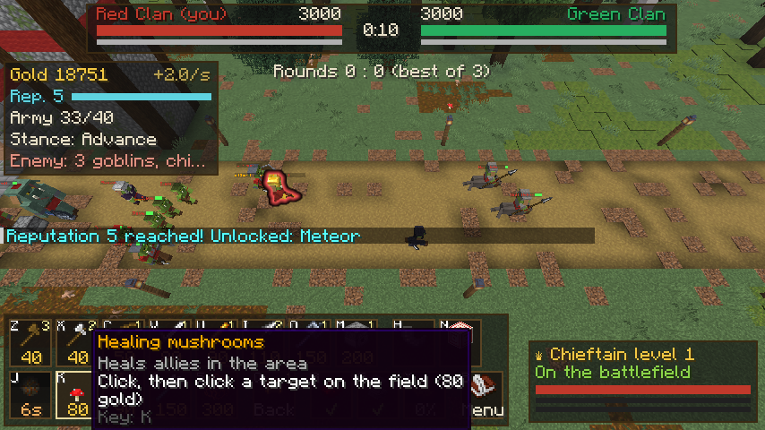

## 0005_goblinforest-06-menue-einheiten

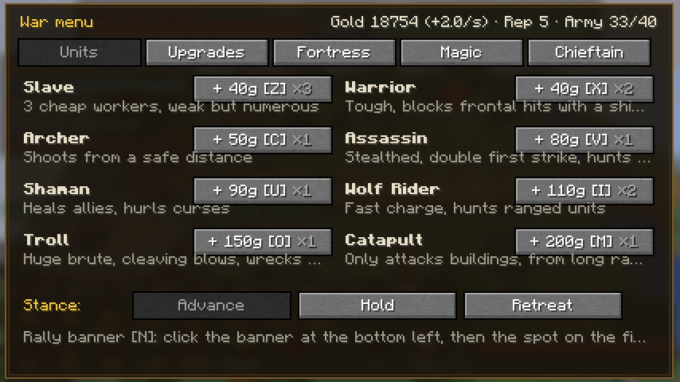

## 0006_goblinforest-07-menue-upgrades

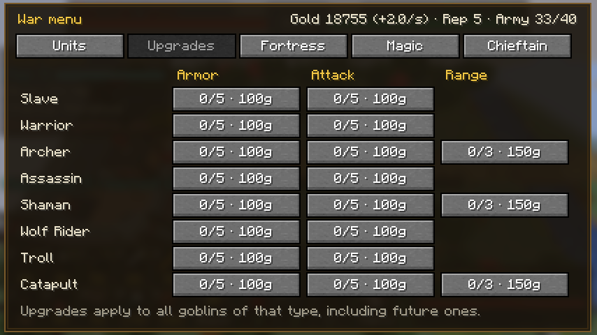

## 0007_goblinforest-07-menue-stronghold

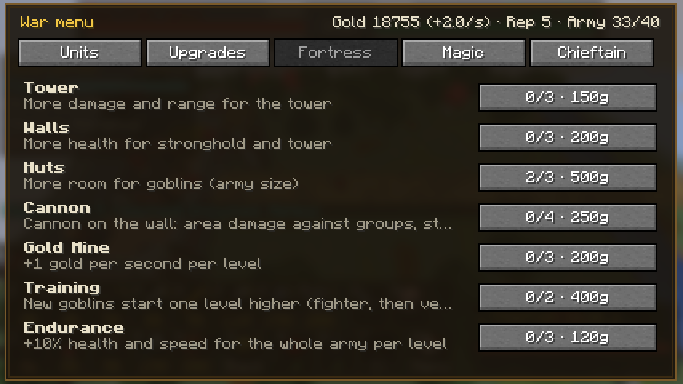

## 0008_goblinforest-07-menue-magic

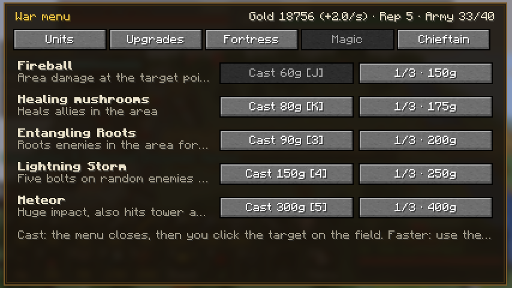

## 0009_goblinforest-07-menue-chieftain

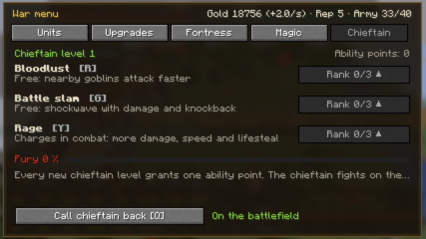

## 0010_goblinforest-08-gefecht

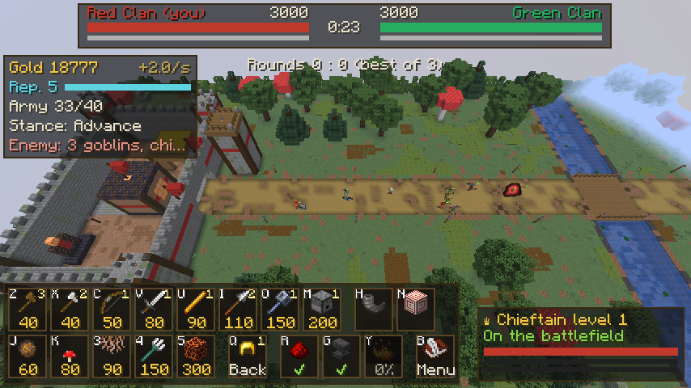
